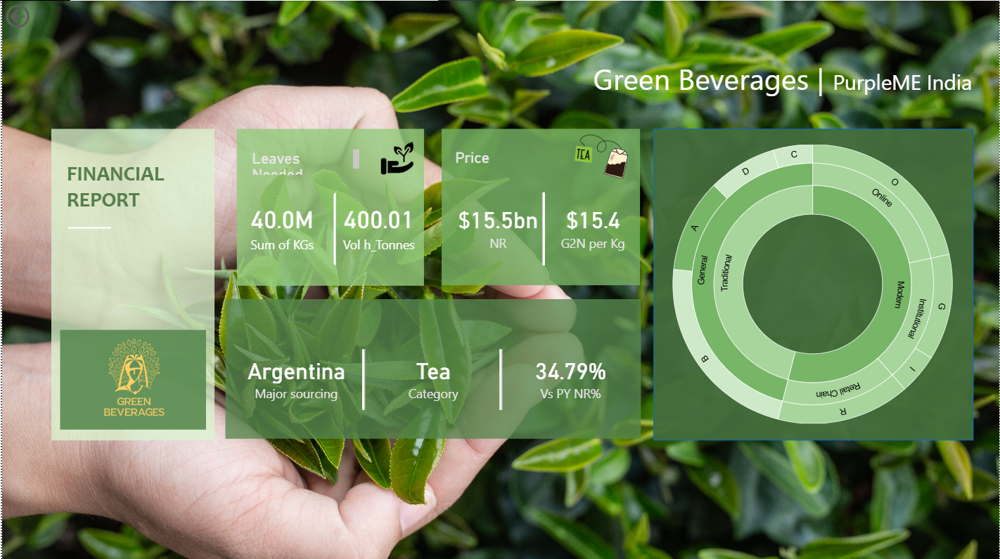
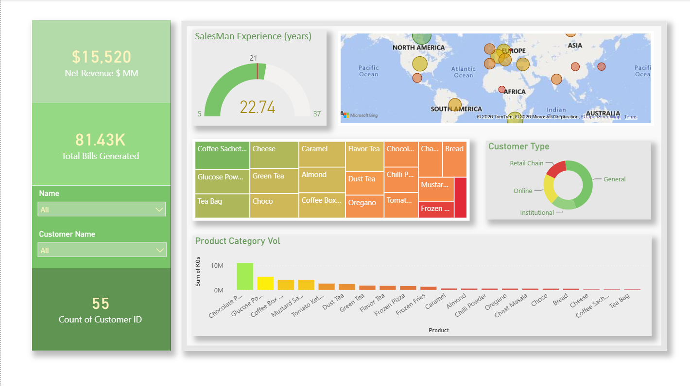
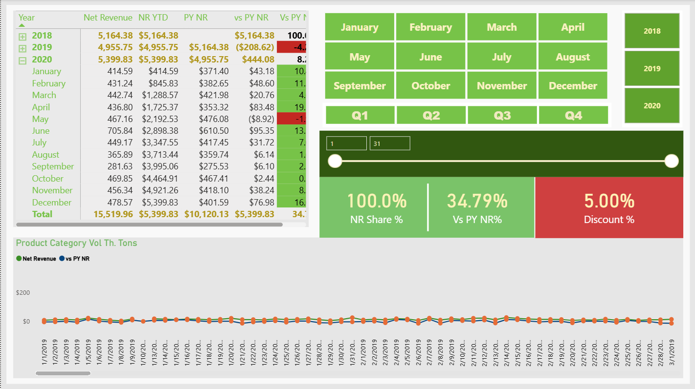

# Green Beverages Financial Analytics Dashboard

## Project Overview

Developed an interactive Power BI dashboard to analyze financial and operational performance of a beverage business.

## Tools Used

- Power BI
- DAX
- Power Query
- Excel

## Dashboard Features

- KPI Tracking
- Geographic Analysis
- Product Performance Analysis
- Interactive Filters
- Trend Monitoring

## Screenshots

### Executive Overview

### Business Performance Analysis

### Detailed Analysis

## Skills Demonstrated

- Data Cleaning
- Data Modeling
- DAX
- Dashboard Design
- Business Intelligence
- Data Visualization

## Project File

